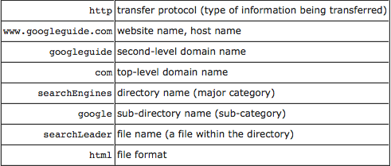

# HowTheInternetWorks
* FORMAL DEFINITION:
  "The Internet, a loosely-organized international collaboration of autonomous, interconnected networks, supports host-to-host communication through voluntary adherence to open protocols and procedures defined by Internet Standards [1]." 
* Domain Name Servers (DNS) are the Internet's equivalent of a phone book. They maintain a directory of domain names and translate them to Internet Protocol (IP) addresses. This is necessary because, although domain names are easy for people to remember, computers or machines, access websites based on IP addresses.
* IP (Internet Protocol) provides a standard set of rules for sending and receiving data over the Internet. It allows devices running on different platforms to communicate with each other as long as they are connected to the Internet.
  
  In order for a Internet-connected host to be recognized by other devices, it must have an IP address. This may be either an IPv4 or IPv6 address, but either way it uniquely defines a device on the Internet.
  
  The Internet Protocol also provides basic instructions for transferring packets between devices
* Domain names are used to identify one or more IP addresses. For example, the domain name microsoft.com represents about a dozen IP addresses. Domain names are used in URLs to identify particular Web pages
* A top-level domain (TLD) is the last segment of the domain name. The TLD is the letters immediately following the final dot in an Internet address.
* How to read a URL:
    * Ex: http://www.googleguide.com/searchEngines/google/searchLeader.html

